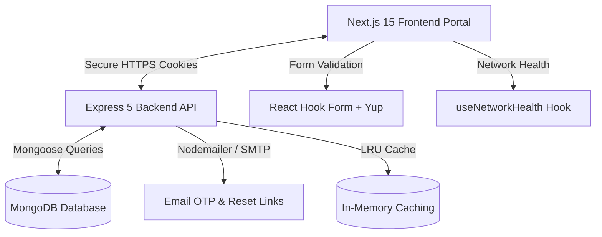

# Unity Drop - Blood Donation Management System

Unity Drop is a secure, fast, and modern digital platform designed to connect blood donors directly with patients in need. By replacing manual and slow coordination with a simple, automated web application, Unity Drop makes it easy to find and request compatible blood donors in critical times.

---

## 🩸 Core Mission & Value Proposition

In emergency medical situations, finding the right blood donor quickly can save lives. Traditional methods like manual phone calls, social media posts, and fragmented messaging groups are slow and unreliable.

**Unity Drop** solves this problem by providing:
* **Direct Connections**: Patients can search for compatible blood donors based on their location (city/state) and send requests directly.
* **Secure and Verified Accounts**: High security featuring Google ReCAPTCHA v2 on forms, email OTP validation, and secure session management.
* **Role-Based Portals**: Symmetrical dashboards and workflows tailored for Patients, Donors, and Administrators.
* **Responsive Performance**: A mobile-first design built to load instantly on any screen size.

---

## ⚙️ Technical Architecture

Unity Drop is built as a split application consisting of a modern Next.js frontend client and a secure Express.js backend API.



### 1. Frontend Client (`unity-drop-web`)
* **Framework**: **Next.js 15** with **React 19** using React Server Components (RSC) and fast Turbopack execution.
* **Styling**: **Tailwind CSS v4** combined with HSL CSS variables, clean typography, and smooth transitions powered by **Framer Motion**.
* **State Management**: **Zustand** for lightweight, persistent global reactive state.
* **Form Handling**: **React Hook Form** paired with **Yup** schemas for strong schema validation.
* **Connection Status**: Custom **`useNetworkHealth`** hook that alerts users with a simple toast if their connection is lost or restored, avoiding background polling.
* **Transitions**: **NextTopLoader** to show a visual loading progress indicator across page transitions.

### 2. Backend API (`unity-drop-api`)
* **Server Runtime**: **Node.js** running an **Express 5** server configured in ES Modules (`"type": "module"`).
* **Database**: **MongoDB** using **Mongoose** with optimized indexes and pagination handlers (`mongoose-paginate-v2`).
* **Caching**: Centralized **LRU-Cache** module to save heavy database queries (like aggregate statistics or donor lists) with automated invalidation hooks on mutating routes.
* **Security & Guarding**: Secure JWT authentication using HttpOnly cookies, **Helmet** security headers, **express-rate-limit** for brute-force defense, and input sanitizers (**express-mongo-sanitize** and **express-xss-sanitizer**).
* **Email Delivery**: **Nodemailer** SMTP setup for account verification codes (OTP) and password reset links.

---

## 👥 Roles & Workflows

Unity Drop maintains clear responsibilities across three user roles:

### 1. Donor Portal
* **Registration & Verification**: Sign up and verify the account with a One-Time Password (OTP) sent to the email.
* **Health Tracker**: Manage and update donor profile status and health history.
* **Request Coordination**: View and filter blood requests from patients in their city matching their blood type. Accept or decline coordination invites with a single click.
* **System Feedback**: Submit direct tickets or feedback reports to system administrators.

### 2. Patient Portal
* **Registration**: Quick sign up with patient-specific profiles.
* **Send Requests**: Request blood by selecting a compatible blood type, specifying the urgent location, and inviting matching donors.
* **Request Management**: Track active request statuses (Pending, Accepted, Declined) and instantly view contact phone numbers of donors who accept.
* **Feedback**: Send feedback and suggestions directly to the admin team.

### 3. Administrator Portal
* **Registration Review**: Admins review and approve newly registered administrative accounts.
* **User Management**: Search, filter, view, and delete records for all Admins, Donors, and Patients in the system.
* **System Analytics**: View active user statistics, request counts, and verified donor distributions on visual dashboards powered by **Recharts**.
* **Feedback Moderation**: Monitor and manage all feedback logs submitted by users.

---

## 🚀 Getting Started

### Prerequisites
* **Node.js** (version 18 or higher)
* **MongoDB** (installed and running locally)
* **Git**

### Installation Guide

#### 1. Clone the Project
```bash
git clone <repository-url>
cd Unity_Drop_FYP_Project
```

#### 2. Setup the Backend API
1. Navigate to the backend folder:
   ```bash
   cd unity-drop-api
   npm install
   ```
2. Create a `.env` file in the `unity-drop-api` directory:
   ```env
   NODE_ENV=development
   PORT=8000
   MONGODB_URI=mongodb://127.0.0.1:27017/unity-drop
   JWT_SECRET=your-secure-jwt-secret-key
   EMAIL_HOST=smtp.gmail.com
   EMAIL_PORT=587
   EMAIL_USER=your-smtp-email@gmail.com
   EMAIL_PASS=your-smtp-app-password
   ```
3. Start the API server in development mode:
   ```bash
   npm run dev
   ```
   The backend will run on `http://localhost:8000`.

#### 3. Setup the Frontend Client
1. Open a new terminal and navigate to the frontend folder:
   ```bash
   cd unity-drop-web
   npm install
   ```
2. Create a `.env` file in the `unity-drop-web` directory:
   ```env
   NEXT_PUBLIC_API_URL=http://localhost:8000
   NEXT_PUBLIC_APP_NAME="Unity Drop"
   NEXT_PUBLIC_APP_VERSION=1.0.0
   NEXT_PUBLIC_RECAPTCHA_SITE_KEY=your-google-recaptcha-site-key
   ```
3. Start the Next.js development server:
   ```bash
   npm run dev
   ```
   The web portal will be accessible at `http://localhost:3000`.

---

## 🔒 Security Practices

1. **Password Hashing**: Done server-side using `bcryptjs` with a secure salt factor of 10.
2. **Session Protection**: JWT authentication tokens are transmitted securely and verified via custom middlewares.
3. **Database Guarding**: All queries pass through `express-mongo-sanitize` to purge MongoDB command operators.
4. **Input Sanitation**: Built-in XSS filters clean request bodies.
5. **Rate Limiting**: Integrated `express-rate-limit` prevents brute-force login and register attempts.

---

## 📄 License
This project is licensed under the **ISC License**.

---
*Built with passion to support communities and save lives.* 🩸
